# Hello, World! 👋

I'm Suraj Kumar, a passionate Python Web Developer from India.

## About Me

- 🔭 I’m currently working on [My Website](https://dsa.pythonanywhere.com/).
- 🌱 I’m currently learning advanced Django features.
- 👯 I’m looking to collaborate on open-source Python projects.
- 💬 Ask me about Python web development and Flask.
<!-- - 📫 How to reach me: [suraj@email.com](mailto:suraj@email.com). -->

## My Interests

- 🚀 Exploring new technologies and developing web applications.
- 📚 Reading books and articles on Data Structures.
- 🏋️‍♂️ Hitting the gym to stay fit.

## GitHub Stats

## 💻 Tech Stack

### Programming Languages

### Web Development

### Version Control and DevOps

### Databases

### Computer Vision

### Data Science and Analysis

### Testing and Automation

### Additional Tools

## Top Languages

## Connect with Me

- [GitHub](https://github.com/Surajkumarsaw1)
- [Website](https://dsa.pythonanywhere.com/)
- [Contact Me](https://dsa.pythonanywhere.com/contact)
